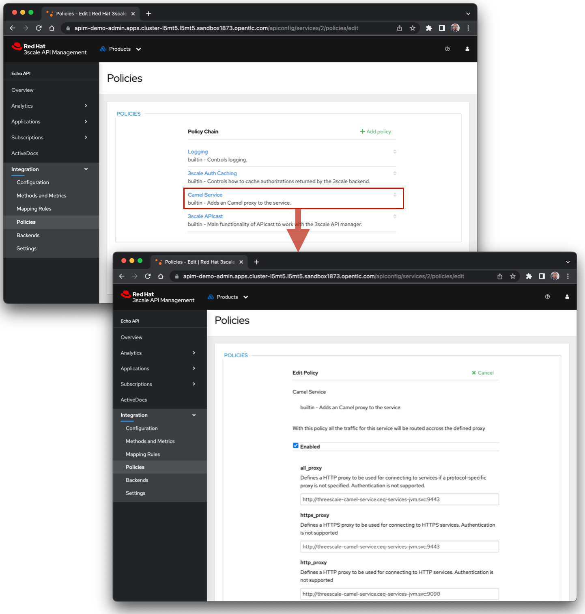

# threescale-camel-service Project

This project uses Quarkus, the Supersonic Subatomic Java Framework.

It implements a proxy service, using [_Red Hat Camel Extensions for Quarkus_](https://access.redhat.com/documentation/en-us/red_hat_integration/2022.q3/html/getting_started_with_camel_extensions_for_quarkus/index), that can be used with the [_Red Hat 3scale APIcast Camel Service policy_](https://access.redhat.com/documentation/en-us/red_hat_3scale_api_management/2.12/html/administering_the_api_gateway/apicast-policies#camel-service_standard-policies). 

The proxy service uses the OAuth2 _client credentials flow_ to obtain an access token from _Red Hat SSO_, and then sets it in the _Authorization_ HTTP header before proxying the request.

If you want to learn more about Quarkus, please visit its website: https://quarkus.io/ .

## O. Prerequisites

- Maven 3.8.1+
- JDK 17 installed with `JAVA_HOME` configured appropriately
- A running [_Red Hat SSO_](https://access.redhat.com/documentation/en-us/red_hat_single_sign-on) instance
- A running [_Red Hat OpenShift_](https://access.redhat.com/documentation/en-us/openshift_container_platform) cluster
- Eventually, a running [_Red Hat 3scale API Management_](https://access.redhat.com/documentation/en-us/red_hat_3scale_api_management) platform

## 1. Generate a Java Keystore

```shell script
keytool -genkey -keypass P@ssw0rd -storepass P@ssw0rd -alias threescale-camel-service -keyalg RSA \
-dname "CN=threescale-camel-service" \
-validity 3600 -keystore ./tls-keys/keystore.p12 -v \
-ext san=DNS:threescale-camel-service.svc,DNS:threescale-camel-service.svc.cluster.local,DNS:threescale-camel-service.camel-quarkus.svc,DNS:threescale-camel-service.camel-quarkus.svc.cluster.local,DNS:threescale-camel-service.ceq-services-jvm.svc,DNS:threescale-camel-service.ceq-services-jvm.svc.cluster.local,DNS:threescale-camel-service.ceq-services-native.svc,DNS:threescale-camel-service.ceq-services-native.svc.cluster.local
```

## 2. Running the application in dev mode

You can run your application in dev mode that enables live coding using:
```shell script
./mvnw compile quarkus:dev
```

> **_NOTE:_**  Quarkus now ships with a Dev UI, which is available in dev mode only at http://localhost:8080/q/dev/.

## 3. Packaging and running the application

The application can be packaged using:
```shell script
./mvnw package
```
It produces the `quarkus-run.jar` file in the `target/quarkus-app/` directory.
Be aware that it’s not an _über-jar_ as the dependencies are copied into the `target/quarkus-app/lib/` directory.

The application is now runnable using `java -jar target/quarkus-app/quarkus-run.jar`.

If you want to build an _über-jar_, execute the following command:
```shell script
./mvnw package -Dquarkus.package.type=uber-jar
```

The application, packaged as an _über-jar_, is now runnable using `java -jar target/*-runner.jar`.

## 4. Creating a native executable

You can create a native executable using: 
```shell script
./mvnw package -Pnative
```

Or, if you don't have GraalVM installed, you can run the native executable build in a container using: 
```shell script
./mvnw package -Pnative -Dquarkus.native.container-build=true
```

You can then execute your native executable with: `./target/threescale-camel-service-1.0.0-SNAPSHOT-runner`

If you want to learn more about building native executables, please consult https://quarkus.io/guides/maven-tooling.

## 5. Running Jaeger locally

[**Jaeger**](https://www.jaegertracing.io/), a distributed tracing system for observability ([_open tracing_](https://opentracing.io/)). :bulb: A simple way of starting a Jaeger tracing server is with `docker` or `podman`:
1. Start the Jaeger tracing server:
    ```
    podman run --rm -e COLLECTOR_ZIPKIN_HTTP_PORT=9411 \
    -p 5775:5775/udp -p 6831:6831/udp -p 6832:6832/udp \
    -p 5778:5778 -p 16686:16686 -p 14268:14268 -p 9411:9411 \
    quay.io/jaegertracing/all-in-one:latest
    ```
2. While the server is running, browse to http://localhost:16686 to view tracing events.

## 6. Test locally
```shell script
print "GET http://localhost:8080/q/health HTTP/1.1\nHost: localhost\nAccept: */*\n\n" | ncat --no-shutdown --ssl localhost 9443
```

## 7. Deploy to OpenShift

```shell script
oc login ...
```
```shell script
oc new-project ceq-services-jvm --display-name="Red Hat Camel Extensions for Quarkus Apps - JVM Mode"
```

### Create secret containing the keystore

```shell script
oc create secret generic threescale-camel-service-keystore-secret \
--from-file=keystore.p12=./tls-keys/keystore.p12
```

### Package and deploy to OpenShift

```shell script
./mvnw clean package -Dquarkus.kubernetes.deploy=true
```

## How to configure the _APICast Camel Service_ policy to use this service

### :bulb: Pre-requisite

- An API Product configured in _Red Hat 3scale API Management_. For instance, the sample `Echo API` can be used.

### Instructions

1. Add and configure the [_APICast Camel Service_](https://access.redhat.com/documentation/en-us/red_hat_3scale_api_management/2.12/html/administering_the_api_gateway/apicast-policies#camel-service_standard-policies) policy on the API Product
    - Reference: https://access.redhat.com/documentation/en-us/red_hat_3scale_api_management/2.12/html/administering_the_api_gateway/transform-with-policy-extension_3scale#configure-apicast-policy-extension-in-fuse_3scale
2. Beware of the following note:
    > *NOTE*: You cannot use `curl` (or any other HTTP client) to test the Camel HTTP proxy directly because the proxy does not support HTTP tunneling using the `CONNECT` method. When using HTTP tunneling with `CONNECT`, the transport is end-to-end encrypted, which does not allow the Camel HTTP proxy to mediate the payload. You may test this with 3scale, which implements this as if proxying via HTTP but establishes a new TLS session towards the Camel application. If you need to perform integration tests against the Camel application you need to use a custom HTTP client. You can use something like: `print "GET https://<backend url> HTTP/1.1\nHost: <backend host>\nAccept: */*\n\n" | ncat --no-shutdown --ssl <camel proxy app host> <camel proxy app port>`

Below is a screenshot of the [_Camel Service_](https://access.redhat.com/documentation/en-us/red_hat_3scale_api_management/2.12/html/administering_the_api_gateway/apicast-policies#camel-service_standard-policies) policy configuration:



## Related Guides

- OpenShift ([guide](https://quarkus.io/guides/deploying-to-openshift)): Generate OpenShift resources from annotations
- OpenID Connect Client ([guide](https://quarkus.io/guides/security-openid-connect-client)): Get and refresh access tokens from OpenID Connect providers
- Camel MicroProfile Health ([guide](https://access.redhat.com/documentation/en-us/red_hat_integration/2.latest/html/camel_extensions_for_quarkus_reference/extensions-microprofile-health)): Expose Camel health checks via MicroProfile Health
- Camel MicroProfile Metrics ([guide](https://access.redhat.com/documentation/en-us/red_hat_integration/2.latest/html/camel_extensions_for_quarkus_reference/extensions-microprofile-metrics)): Expose metrics from Camel routes
- Camel Bean Validator ([guide](https://access.redhat.com/documentation/en-us/red_hat_integration/2.latest/html/camel_extensions_for_quarkus_reference/extensions-bean-validator)): Validate the message body using the Java Bean Validation API
- YAML Configuration ([guide](https://quarkus.io/guides/config#yaml)): Use YAML to configure your Quarkus application
- RESTEasy JAX-RS ([guide](https://quarkus.io/guides/rest-json)): REST endpoint framework implementing JAX-RS and more
- Camel Bean ([guide](https://access.redhat.com/documentation/en-us/red_hat_integration/2.latest/html/camel_extensions_for_quarkus_reference/extensions-bean)): Invoke methods of Java beans
- Kubernetes Config ([guide](https://quarkus.io/guides/kubernetes-config)): Read runtime configuration from Kubernetes ConfigMaps and Secrets
- Camel OpenTracing ([guide](https://camel.apache.org/camel-quarkus/latest/reference/extensions/opentracing.html)): Distributed tracing using OpenTracing
- Camel Netty HTTP ([guide](https://camel.apache.org/camel-quarkus/latest/reference/extensions/netty-http.html)): Netty HTTP server and client using the Netty 4.x

## Provided Code

### YAML Config

Configure your application with YAML

[Related guide section...](https://quarkus.io/guides/config-reference#configuration-examples)

The Quarkus application configuration is located in `src/main/resources/application.yml`.

### RESTEasy JAX-RS

Easily start your RESTful Web Services

[Related guide section...](https://quarkus.io/guides/getting-started#the-jax-rs-resources)
